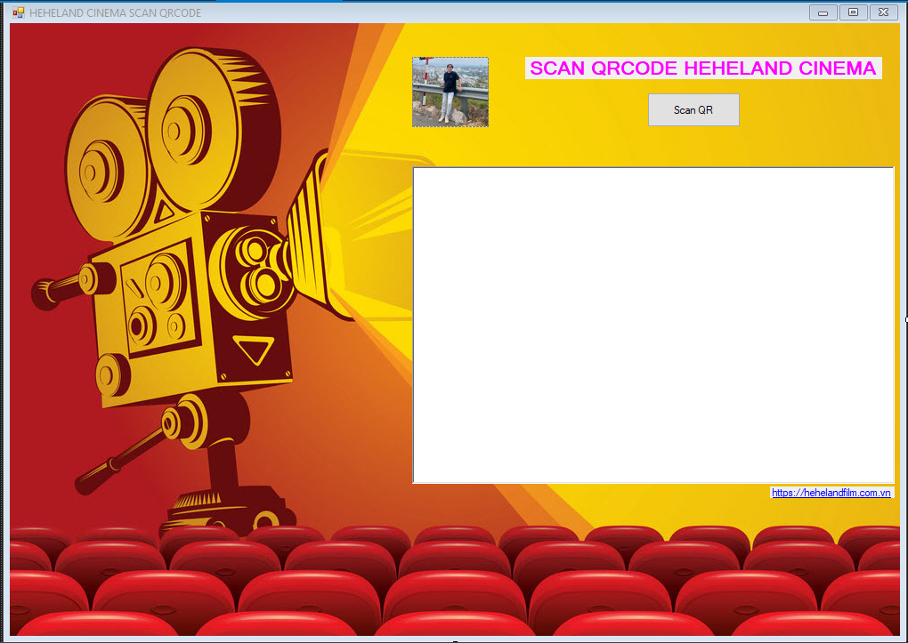

# QRcode_ticket

   

This is a model we use to assiociate to ESP332cam.  Beside using for scanning QR code , it contains a windorm which is written by  C# for user easily 
use with one button SCAN QR and one richtextbox to print result. In additionwe also associate to some functions to get json from database as well as
update status for ticket before/after scanning QR.

Limited system:

When we use C# with a device hardware we meet some difficulties about warning of system. Especially in thread of system, it make some delay time as well as
asynchoronous between device and software.
